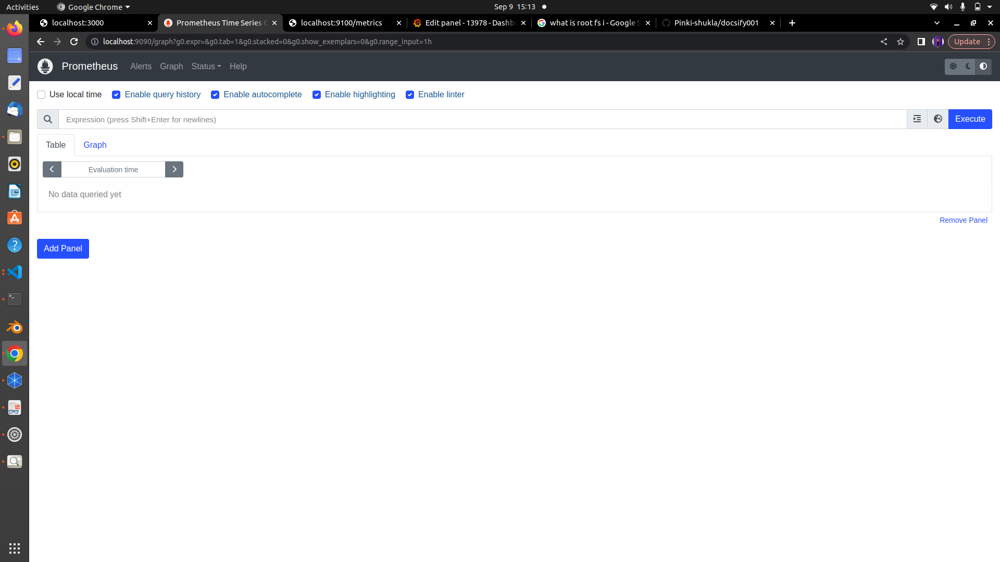

<center> <u> <h1 style="font-size: 50px;">Setup Monitoring Tools using Grafana, Prometheus, and Node-exporter</center></h1> </u> </center><br>


# Monitoring :

Regular collection of information and data to measure progress of projects and activities so we can track performance and resources utilisation over time.

  
# System Configuration

* OS Name : Ubuntu 20.04.6 LTS
* RAM : 5.6 GiB
* CPU : 12
* STORAGE : 512.1 GB
# Prerequisites tools:

- Grafana
- Prometheus
- Node-exporter

# Grafana :

Grafana open-source software enables you to query, visualise, alert on, and explore your metrics, logs, and traces wherever they are stored.

* Query
* Visualise
* Alert


# Installation Process:

## Step-1 Create a Grafana container:
To run the latest stable version of Grafana, run the following command:

```
podman run -d -p 3001:3000 --name=grafana docker.io/grafana/grafana-enterprise

```


Where:

<b>  run</b> = run directly from the command line<br>
<b>d </b>= run in the background<br>
<b>p </b>= assign the port number, which in this case is 3001<br>
<b>name</b> = assign a  name to the container, for example, grafana<br>


**docker.io/grafana/grafana-enterprise:** This is the name of the image we want to run inside the container. It's called 'grafana-enterprise,' and it's stored in a special place on the internet called 'Docker Hub.'


# Prometheus :

Prometheus is an open source monitoring solution written in Go that collects metrics data and stores that data in a time series database. 
Grafana allows to visualise the data stored in prometheus.


## Step-2 Create Prometheus container on Podman:

<b>Create directory :-</b>
```
mkdir prometheus
```
<b>Create file:-</b>
```
 vim prometheus.yml
 ```

#### prometheus.yml is a configuration file of prometheus.

(push all the data in your prometheus.yml file which has been given below)

```
global:
  scrape_interval: 5s
  external_labels:
	monitor: 'node'

scrape_configs:
  - job_name: 'prometheus'
	static_configs:
  	- targets: ['192.168.1.57:9090']

  - job_name: 'node-exporter'
	static_configs:
  	- targets: ['192.168.1.57:9100']

  ```


```
  podman run -d --name prometheus -p 9090:9090 -v /home/pinki/prometheus/prometheus.yml:/etc/prometheus/prometheus.yml docker.io/prom/prometheus
 ```

 

<b>podman run:</b> This part of the command instructs podman to run a container.

<b>d:</b> This flag stands for "detached" mode. It runs the container in the background

<b>--name prometheus:</b> This flag assigns a name to the container. In this case, the container is named "prometheus."

<b>-p 9090:9090:</b> This flag specifies port mapping. It tells podman to map port 9090 on the host to port 9090 inside the container. 

<b>-v /home/amit/prometheus/prometheus.yml:/etc/prometheus/prometheus.yml:</b> This flag specifies a volume mount. It connects a directory or file on your host system to a location inside the container.

In this case, it's mounting the file /home/pinki/prometheus/prometheus.yml from your host into the container at /etc/prometheus/prometheus.yml 

  * <b>" /home/pinki/prometheus/prometheus.yml":</b> This is the path to the Prometheus configuration file on your host. It's being shared with the container.  

*  <b>"/etc/prometheus/prometheus.yml": </b>This is where Prometheus expects its configuration file to be inside the container.

<b> docker.io/prom/prometheus: </b>This is the name of the Docker image you want to run as a container. It specifies the image's repository and name. In this case, you are running the "prometheus" image from the "prom" repository on Docker Hub


  


  

 # Node-exporter:

Node Exporters collect data from the system.
## Step-3 Create Node exporter container on podman

```

podman run -d --name=node-exporter -p 9100:9100 -v"/:/host:ro,rslave" quay.io/prometheus/node-exporter:latest --path.rootfs=/host

 ```

 

 <b>podman run:</b> This part of the command instructs podman to run a container.

 <b>-d:</b> This flag stands for "detached" mode.</b>

 <b>--name=node-exporter:</b> This flag assigns a name to the container. In this case, the container is named "node-exporter." 

 <b>-p 9100:9100: </b>This flag specifies port mapping. it allows you to access the service inside the container via port 9100 on your host.

 <b>"/:/host:ro,rslave": </b> This part specifies the volume configuration. It tells podman to mount the root directory of your host (represented by <b>"/"</b>) to the <b>"/host"</b> directory inside the container. The<b> "ro"</b> option stands for "read-only," which means the container can read the files on the host but can't modify them. The rslave option is related to mount propagation, allowing mounted file systems to be shared among containers.


 <b>quay.io/prometheus/node-exporter:latest:</b> In this case, you are running the "node-exporter" image from the "prometheus" repository on Quay.io. The ":latest" tag indicates that you want to use the latest version of this image.


 <b>--path.rootfs=/host:</b> This is an additional command passed to the container. It specifies the root file system path as "/host" inside the container. This can be important for some containerized applications to correctly access system resources.


 

 

 # Now you can see our all containers are ready grafana,prometheus and node-exporter

  


 ```
 podman ps
  ```

  The <b>podman ps</b> command is used to list the currently running containers on your system. It provides information about the containers that are actively running and includes details such as the container ID, names, status, and other relevant information.

 
 


# Grafana setup has been ready 


    

    


    


